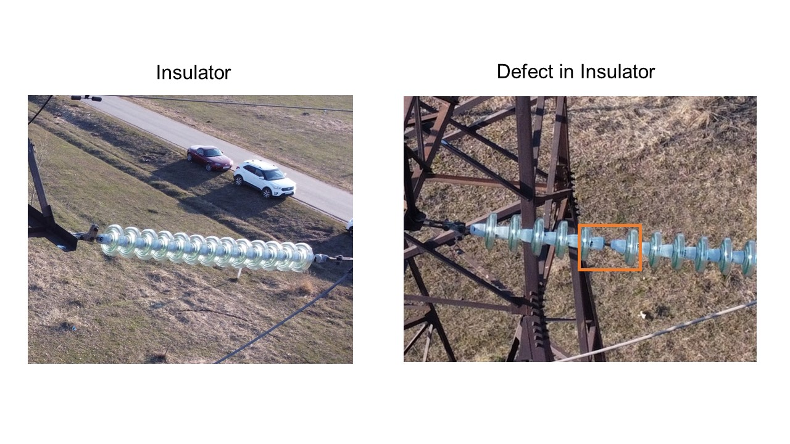

This repository contains source code for the AI Energy Hackathon. Competition's overview is available on [Kaggle](https://www.kaggle.com/competitions/innopolis-high-voltage-challenge).  
This computer vision solution detects the absence of insulators on electric power lines. An object detection model returns a bounding box for the defect.  
  

  
## Solution Approach
#### Data Preparation
Данные собирались из нескольких источников:  
- изображения с платформы [Roboflow](https://universe.roboflow.com/traincodelablan2/traincodelab/browse?queryText=&pageSize=50&startingIndex=0&browseQuery=true)
- фотографии опор ЛЭП из сервисов Яндекс.Панорамы и Google Street View
- кадры фотосъемки с дрона, предоставленные для хакатона, использовались для валидации модели  
  
#### Approach 1
Для обучения использовалась модель YOLOv8, для инференса - техника [SAHI](https://github.com/obss/sahi), эффективная для детекции объектов малых размеров, как в случае аэросъемки с дрона.

#### Approach 2
На первом этапе селективным поиском выделялись регионы интереса с высокой вероятностью содержащие внутри себя объекты. На втором этапе выбранные регионы рассматривались классификатором R-CNN для определения принадлежности исходным классам.

## Project Structure
```doctest
├── datasets                       <- Директория для хранения изображений и аннотаций для обучения
│   └── data.yaml              
├── imgsearch                      <- Модуль с настройками конфигурации и вспомогательными функциями, используемыми в коде  
│   ├── config.py  
│   └── iou.py  
├── models                         <- Обученные модели и веса  
│   ├── defect_detector.h5  
│   ├── label_encoder.pickle  
│   └── yolo_best.pt  
├── build_dataset.py               <- Скрипт для создания датасета с дефектами и без для обучения классификатора  
├── detect_object.py               <- Скрипт для инференса классификатором ResNet на основе выделения регионов интереса  
├── main.py                        <- Скрипт для получения предсказаний обученной yolo-моделью 
├── README.md  
├── requirements.txt               <- Файл со списком зависимостей виртуального окружения  
├── train_yolo.py   
└── tune_resnet.py                 <- Код для обучения ResNet-модели
```
